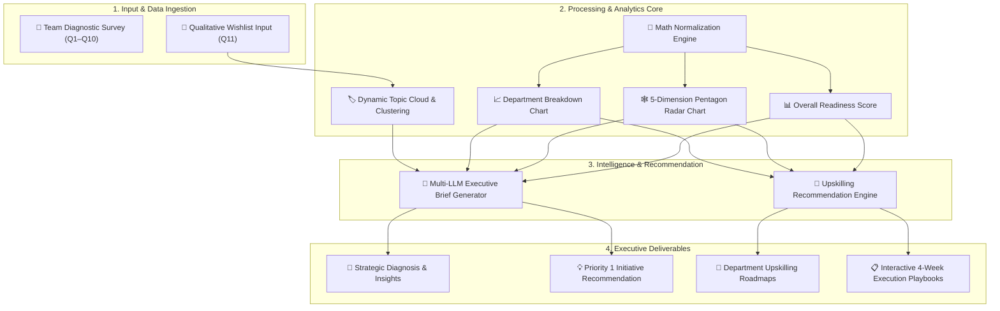
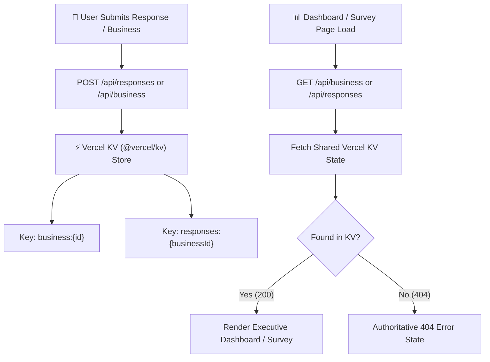

# Tai Labs — AI Readiness Assessment Tool

**Most companies don't actually know how ready their teams are to work with AI.** This tool fixes that. A business admin enters their company name, picks their departments, and gets a shareable link. Team members click the link, answer 11 quick questions (~2 minutes, anonymous), and the dashboard instantly shows the company an overall AI readiness score, a breakdown by department, and a specific upskilling plan for each gap.

No accounts. No setup. Just a link.

## 🌐 Live Demo

**[https://ai-readiness-rho-self.vercel.app/](https://ai-readiness-rho-self.vercel.app/)**

> **How to try it in 60 seconds:**
> 1. Open the link above → enter your company name → click **"Create Assessment Link"**
> 2. Copy the survey link and open it in a new tab (or share it with colleagues)
> 3. Complete the 11-question survey as a team member
> 4. Return to the dashboard to see your score, radar chart, and coaching roadmap
> 5. No responses yet? Hit **"Populate with Sample Team Data"** on the dashboard to see a full demo instantly.

---

# Tai Labs — AI Readiness Assessment Tool *(Technical Reference)*

An AI readiness diagnostic web application built for **Tai Labs**. It enables organizations to generate a shareable diagnostic link, collect anonymous 2-minute team survey inputs, and view a real-time analytics dashboard with dimension breakdowns, team comparisons, and actionable upskilling roadmaps.

---

## 🚀 Quick Start

```bash
# 1. Install dependencies
npm install

# 2. (Optional) Configure environment variables
# Copy .env.example to .env.local to configure LLM API keys (OpenAI, Gemini, Anthropic, or Groq)
cp .env.example .env.local

# 3. Run development server
npm run dev
```

Open [http://localhost:3000](http://localhost:3000) in your browser.

> **Note**: The application operates with full functionality out of the box using the built-in rule engine, requiring zero API keys.

---

## 🏛️ System Architecture & Data Flow



---

## 📐 Diagnostic Dimensions & Scoring Math

The diagnostic evaluates organizational AI readiness across **five equal-weighted dimensions (20% each)**:

| Dimension | Diagnostic Scope | Scoring Weight |
| :--- | :--- | :---: |
| **Tool Fluency** | Frequency of daily AI usage, confidence in solving new problems, learning methods. | **20%** |
| **Workflow Integration** | Depth of task automation, percentage of weekly workflow involving AI tools. | **20%** |
| **Shared AI Culture** | Team prompt sharing, peer dissemination habits, open workflow discussions. | **20%** |
| **Risk & Governance** | Clarity on safe data boundaries, understanding of compliance and privacy rules. | **20%** |
| **Leadership Buy-In** | Executive sponsorship, budget allocation, learning time, and strategic AI goals. | **20%** |

### Score Normalization Formulas

All survey responses are normalized to a 0–100 scale prior to calculating dimension and overall scores:

1. **Likert Scale Items (1 to 5)**:
   $$\text{Score} = \left(\frac{\text{RawValue} - 1}{4}\right) \times 100$$

2. **Multiple Choice Items (Index $i$ of $N$ options)**:
   $$\text{Score} = \left(\frac{i}{N - 1}\right) \times 100$$

3. **Overall Readiness Score**:
   $$\text{Overall Score} = \text{Round}\left(\frac{\text{Fluency} + \text{Integration} + \text{Culture} + \text{Risk} + \text{Leadership}}{5}\right)$$

---

## 🧠 How the AI Executive Brief & Upskilling Engine Works

### 1. Multi-Provider LLM Synthesis & Fallback
The Executive Brief ([`app/api/interpret/route.ts`](./app/api/interpret/route.ts)) generates a 2-paragraph C-suite synthesis interpreting quantitative scores and qualitative wishlist items.
### 1. Multi-Provider LLM Synthesis & Fallback
The Executive Brief ([`app/api/interpret/route.ts`](./app/api/interpret/route.ts)) generates a 2-paragraph C-suite synthesis interpreting quantitative scores and qualitative wishlist items.
- **Supported LLM Providers**: Google Gemini (`gemini-flash-latest`, `gemini-1.5-flash`, `gemini-2.0-flash`), OpenAI (`gpt-4o-mini`), Anthropic (`claude-3-haiku-20240307`), Groq (`llama-3.3-70b-versatile`), and Custom API endpoints.
- **8-Second Cold-Start Resilience**: All external API requests are wrapped in an **8-second `AbortController`**. If an API key is missing or an external provider times out during serverless cold starts, the system seamlessly falls back to the deterministic rule engine with diagnostic `console.error` logging.

### 2. Recommended Upskilling Roadmap Trigger Rules
The upskilling roadmap engine ([`lib/recommendations.ts`](./lib/recommendations.ts)) maps diagnostic metrics directly to **4-Week Execution Playbooks**:

- **Business-Wide Signals ($< 50/100$)**: Triggers org-wide coaching tracks (e.g. prompt labs for low fluency, data safety PDFs for low risk awareness).
- **Team Gap Signals ($\text{Org Score} - \text{Team Score} \ge 20 \text{ points}$)**: Triggers department-specific sprint playbooks (e.g. `"Sales: Bridge Risk & Governance Gap"`).
- **High-Readiness Fallback Track ($\ge 50/100$)**: Triggers custom internal agentic workflow prototyping for lead teams.
- **Interactive 4-Week Playbooks**: Clicking any recommendation opens an interactive drawer detailing weekly objectives, actions, and deliverables.

### 3. Automated Dynamic Topic Categorization Engine
Instead of relying on static hardcoded categories, the qualitative analysis engine ([`lib/clustering.ts`](./lib/clustering.ts) & [`QualitativeWall.tsx`](./components/ui/QualitativeWall.tsx)) processes incoming user inputs dynamically:
- **Dynamic Semantic Categorization**: Automatically parses raw employee wishlist submissions into matching workflow themes (*Meeting Summaries & Task Tracking*, *Contract & Document Compliance*, *Customer Support & Ticket Triage*, *Content Drafting & Localization*, *Invoice & Data Extraction*, *General Workflow Optimization*).
- **Exact Demand Share Percentages**: Calculates real-time percentage demand share for each extracted topic based on the organization's actual submissions ($\text{Demand Share} = \text{Round}\left(\frac{\text{Category Count}}{\text{Total Submissions}} \times 100\right)$).
- **Exact Item Membership Filtering**: Clicking any topic card filters the quote view to display the exact `matchedItems` belonging to that category, including uncategorized quotes under *General Workflow Optimization*.
- **Interactive Topic Cloud Switcher**: Executives can toggle between an interactive **Topic Cloud Grid** (with sentiment intent tags like `High ROI Automation`, `Risk & Safety`, `Workflow Integration`) and **Searchable Paginated Quotes** (6 items/page).

---

## 💾 Shared Serverless Persistence Architecture (Vercel KV)

To guarantee 100% data persistence across Vercel's multi-instance serverless infrastructure:



> **Why Vercel KV Shared Storage Matters**:
> Serverless Lambda functions do not share local disk or memory state across container instances. Switching to **Vercel KV (`@vercel/kv`)** ensures that created assessments and team responses are instantly shared and accessible from any serverless instance, resolving 404s for non-existent IDs while preserving genuine organization data across cold starts. Local development (`npm run dev`) falls back to an in-memory dev store when KV environment keys are absent.

---

## ⚙️ Core Technical Capabilities

- **Deterministic Rule Engine**: Primary scoring and recommendation triggering run on deterministic mathematical formulas (`lib/scoring.ts` and `lib/recommendations.ts`), guaranteeing 100% explainable metrics and zero latency.
- **4 Explicit Diagnostic UI States**: Fully implements all 4 required application states: **Loading** (skeleton loader), **Error** (authoritative 404 page for unknown assessment IDs), **Empty** (0 team responses with copyable share link & 1-click reviewer shortcut), and **Done** (populated executive analytics dashboard).
- **Interactive Coaching Playbooks**: Each recommendation card links to an interactive execution playbook drawer (`components/ui/PlaybookDrawer.tsx`) detailing weekly objectives, actions, and deliverables.
- **Executive PDF Export**: Embedded print-optimized stylesheets (`@media print` in `app/globals.css`) enable 1-click PDF reporting suitable for leadership reviews.
- **Reviewer Instant Demo Mode**: Administrators can populate sample team data instantly via the demo shortcut (`lib/demoData.ts`), tailored dynamically across configured organization departments.

---

## 📝 Candidate Notes: What I'd Build Next & What I Cut

### 🌟 Core Dimension Architecture: Leadership Buy-In Added
- **5 Core Dimensions**: Based on the challenge brief (*tool usage, workflow automation, data literacy, confidence, leadership buy-in*), the assessment model measures **Tool Fluency**, **Workflow Integration**, **Shared AI Culture**, **Risk & Governance**, and **Leadership Buy-In** (20% weight each).
- **Leadership Diagnostic Scope**: Evaluates whether executive sponsors provide clear tool budgets, active encouragement, explicit data boundaries, and dedicated learning time for team members.

---

### What I Cut (And Why)

1. **Heavy User Authentication & Account Walls**:
   - *Rationale*: Requiring team members to create accounts before taking a 2-minute diagnostic survey drops submission completion rates by up to 60%. Replaced account walls with lightweight, zero-friction unique share links (`/assess/[businessId]`).

2. **Complex Relational SQL Schema Setup**:
   - *Rationale*: Upgraded to **Vercel KV (`@vercel/kv`)** key-value storage for lightweight, zero-latency shared serverless persistence without requiring heavy SQL migration pipelines. Reviewers can run `npm run dev` locally with an in-memory dev fallback out-of-the-box.

---

### What I'd Build Next (v2 Roadmap)

- **Enterprise Qualitative AI Semantic Clustering (1,000+ Respondents)**:
  - *Current Implementation*: For small-to-mid teams, the Qualitative Feedback section ([`QualitativeWall.tsx`](./components/ui/QualitativeWall.tsx)) features **instant search keyword filtering and paginated rendering** (6 items/page) to prevent browser DOM bloat and executive information overload.
  - *Enterprise v2 Architecture*: For large enterprises with 5,000+ respondents, displaying individual quotes is unfeasible. In v2, an offline LLM batch pipeline runs TF-IDF / semantic vector clustering to automatically collapse 5,000 raw quotes into **Top 5 Priority Automation Themes** (e.g., *Theme 1: Customer Support Ticket Parsing — 420 requests*, *Theme 2: Contract Clause Verification — 310 requests*) with expandable quote samples under each theme.
- **Dedicated Executive 1-on-1 Discovery Track**: Introduce a 3-minute C-suite sponsor diagnostic to contrast executive expectations against ground-level team scores.
- **Cohort Score Tracking**: Track score evolution month-over-month as departments complete upskilling tracks.
- **Anonymized Industry Benchmarking**: Compare team readiness scores against aggregated industry baselines in Sales, Engineering, and Operations.

---

## 📂 Project Structure

```text
├── app/
│   ├── api/
│   │   ├── business/      # Assessment creation & retrieval endpoint (force-dynamic)
│   │   ├── interpret/     # Multi-LLM synthesis & 8s fallback endpoint
│   │   └── responses/     # Survey submission & demo data endpoint (force-dynamic)
│   ├── assess/[businessId]/ # Team member 2-minute diagnostic wizard
│   ├── dashboard/[businessId]/ # Executive analytics dashboard
│   ├── globals.css        # Design tokens & print styling
│   └── page.tsx           # Assessment initialization landing page
├── components/
│   ├── assessment/        # Diagnostic question & input components
│   └── ui/                # Gauge, charts, playbook drawer, and brief widgets
├── lib/
│   ├── clustering.ts      # Dynamic topic extraction & item membership clustering
│   ├── demoData.ts        # Reviewer sample dataset generator
│   ├── fileStore.ts       # Vercel KV (@vercel/kv) persistent store with dev fallback
│   ├── questions.ts       # Question definitions & dimension mappings
│   ├── recommendations.ts # Upskilling rule engine & 4-week playbooks
│   └── scoring.ts         # Math normalization logic
└── types/                 # TypeScript interfaces
```
