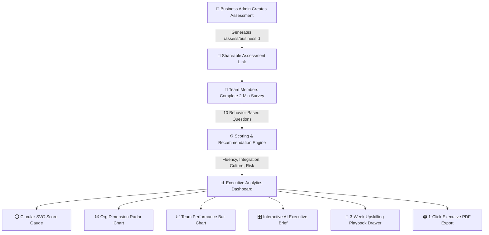

# ⚡ Tai Labs — AI Readiness Assessment Tool for Teams

> **Product Vision**: Clinical confidence crossed with a coaching companion. A high-craft diagnostic web application built for **Tai Labs** that turns organizational AI uncertainty into a clear readiness score, team-by-team breakdown, and targeted upskilling roadmap.

---

## 🚀 Quick Start (Run Locally)

```bash
# 1. Install dependencies
npm install

# 2. (Optional) Configure LLM API Keys
# Create a .env.local file in the root directory (see .env.example)
OPENAI_API_KEY=sk-...
ANTHROPIC_API_KEY=sk-ant-...
GEMINI_API_KEY=AIzaSy...
GROQ_API_KEY=gsk_...

# 3. Run local development server
npm run dev
```

> **Note**: The app runs 100% reliably out-of-the-box using the built-in Tai Labs Diagnostic Engine even if no API keys are provided.

Open **[http://localhost:3000](http://localhost:3000)** in your browser.

---

## 🗺️ System Architecture & Product Flows



---

## 🎯 The 4 Diagnostic Dimensions

| Dimension | Icon | Diagnostic Focus | Scoring Weight |
| :--- | :---: | :--- | :---: |
| **Tool Fluency** | 🛠️ | Frequency of daily AI usage, confidence in solving new problems, learning methods. | **25%** |
| **Workflow Integration** | ⚙️ | Depth of task automation, percentage of weekly workflow involving AI tools. | **25%** |
| **Shared AI Culture** | 🤝 | Team prompt sharing, peer dissemination habits, open workflow discussions. | **25%** |
| **Risk & Governance** | 🛡️ | Clarity on safe data boundaries, understanding of compliance/privacy rules. | **25%** |

---

## ✨ Key Features & Micro-Polish Upgrades

```
+-----------------------------------------------------------------------------------------------+
|  FEATURE HIGHLIGHTS                                                                           |
|                                                                                               |
|  [⭕ Score Gauge]  [🎛️ Interactive AI Brief]  [📖 3-Wk Playbook]  [🖨️ Executive PDF Export] |
+-----------------------------------------------------------------------------------------------+
```

1. **⭕ Signature Circular SVG Score Gauge**:
   - Animated circular SVG ring (1.2s ease-out) with score count-up in **Fraunces** serif typography.
   - Dynamic **Monochrome Intensity Scale** (`#C9D6D6` low → `#6FA3A3` mid → `#2A6F6F` high), explicitly avoiding generic red/yellow/green traffic lights.

2. **🎛️ Interactive AI Executive Brief**:
   - Features 3 scannable interactive tabs:
     - **`📊 Key Strategic Takeaways`**: Visual cards isolating *Advanced Pods*, *Capability Deficit*, and *Governance Barriers*.
     - **`🚀 Priority 1 Initiative`**: Action card outlining the recommended first move with target team pills and ROI metrics.
     - **`💬 Team Wishlist Themes`**: Grouped automation demand clusters derived from qualitative team feedback.

3. **🌐 Dynamic Multi-Provider LLM Integration**:
   - On-the-fly selector supporting **Auto-Detect**, **OpenAI (GPT-4o)**, **Anthropic (Claude 3.5)**, **Google Gemini (`gemini-flash-latest`)**, **Groq (Llama 3.3)**, and **Custom/Ollama** endpoints.

4. **📖 3-Week Interactive Coaching Playbook Drawer**:
   - Clicking any recommendation card slides open a detailed 3-week execution playbook with weekly milestones, specific action steps, and tangible deliverables.

5. **🏷️ Recommendation Category & Team Filters**:
   - Filter pills above recommendations allowing admins to isolate advice by `All`, `High Priority`, or team gaps (`Sales`, `Support`).

6. **🖨️ 1-Click Executive PDF/Print Export**:
   - Built-in `🖨️ Export Report` button triggers print-optimized PDF styling (`@media print`) tailored for executive presentation decks.

7. **🔘 1-Click "Select All / Deselect All" Department Picker**:
   - Admin creation page includes a 1-click toggle to select or deselect all department pills instantly with visual checkmarks (`✓`).

---

## 🎭 User Journey Scenarios

### 👤 Scenario 1: The Business Executive / Admin
1. **Create & Customize**: Enters organization name, toggles departments via 1-click `"Select all" / "Deselect all"`.
2. **Distribute**: Copies `/assess/[businessId]` link and shares it via Slack, Teams, or Email.
3. **Monitor & Analyze**: Watches overall readiness score count up on the animated circular gauge (`56/100`), inspects department scores on the radar chart, and identifies lagging teams (e.g. Sales at `34/100`).
4. **Interactive Brief**: Explores the 3-tab AI Executive Brief and clicks recommendation cards to open the 3-week execution playbook drawer.
5. **Executive Sync**: Clicks `🖨️ Export Report` to generate a 1-page PDF for board meetings.

### 👥 Scenario 2: The Individual Team Member
1. **Frictionless Entry**: Opens `/assess/[businessId]` on mobile (375px) or desktop without creating an account.
2. **Department Selection**: Picks their department (e.g., *Sales*).
3. **Focused Diagnostic**: Completes 10 behavior-focused questions using tactile segmented controls (no radio buttons).
4. **Task Wishlist**: Optionally submits repetitive manual tasks they wish AI could help automate.
5. **Confirmation**: Receives completion screen acknowledging their contribution to company baseline.

### 🏢 Scenario 3: Tai Labs Sales & Coaching Lead (GTM Conversion)
1. **Zero-Friction Prospecting**: Offers the free assessment tool to prospective enterprise clients.
2. **Proves the Problem**: Free diagnostic proves exact weak areas (e.g., *"Sales is lagging 20+ points in Tool Fluency"*).
3. **Closes Paid Deals**: Converts free diagnostic insights directly into paid **$10k–$50k 12-Week Custom Training Engagements**.

---

## ⚖️ Why Rule-Based Engine vs. LLM?

> **The Common Question**: *"Why use a rule-based engine? Don't LLMs perform better?"*

```
+---------------------------------------------------------------------------------------+
|  WHY DETERMINISTIC MATH WINS FOR DIAGNOSTICS                                          |
|                                                                                       |
|  [ Survey Inputs ] ───> [ 100% Math Normalization ] ───> [ Unassailable Score & Alert ] |
|                                                                                       |
|  NO Hallucinations  |  NO Random Score Fluctuations  |  NO API Latency / Token Fees |
+---------------------------------------------------------------------------------------+
```

| Dimension | ⚙️ Deterministic Rule Engine (Our App) | 🤖 LLM Generation (GPT-4 / Claude) |
| :--- | :--- | :--- |
| **100% Explainable Math** | ✅ **Yes**: `((Raw - 1)/4) * 100`. Every point is math-proven. | ❌ **No**: Black box. Scores fluctuate randomly between runs. |
| **Zero Hallucinations** | ✅ **Yes**: Recommendations are strictly triggered by verified data signals. | ❌ **No**: Risks hallucinating fake team gaps or irrelevant corporate jargon. |
| **Latency & Cost** | ⚡ **Instant (<10ms)** \| $0 API cost. | 🐢 **Slow (2–5s)** \| Requires API keys & ongoing token fees. |
| **Enterprise Uptime** | ✅ **100% Uptime**: Never fails due to API outages or rate limits. | ❌ **Risk**: Fails if LLM API rate limit or outage occurs. |

### 🧭 Product Judgement: Where Each Belongs
- **Use Rule-Based Engine for (Our Core App)**: Diagnostic scoring, dimension aggregation, and threshold-based upskilling alerts—where mathematical truth, speed, and executive trust matter most.
- **Use LLMs for (Our Brief & Synthesis)**: Summarizing qualitative wishlist items into scannable executive takeaways and priority initiatives.

---

## 📐 Scoring Math & Normalization

All raw question inputs are normalized to a **0–100** scale before computing dimension and overall scores:

1. **Likert Scale Items (1 to 5)**:
   ```text
   Score = ((RawValue - 1) / 4) * 100
   ```
   *Example: Value 1 → 0% | Value 3 → 50% | Value 5 → 100%*

2. **Multiple Choice Items (Index i of N options)**:
   ```text
   Score = (OptionIndex / (OptionCount - 1)) * 100
   ```
   *Example: Choice 1 of 4 (Index 0) → 0% | Choice 4 of 4 (Index 3) → 100%*

3. **Overall Readiness Score**:
   ```text
   Overall Score = Round((Fluency + Integration + Culture + Risk) / 4)
   ```

---

## 🎭 The 4 Intentional Product States

| Product State | Visual Behavior | Trigger Condition |
| :--- | :--- | :--- |
| **1. Empty State** | Headline *"No responses yet"*, shareable link input with *"Copy link"* button, no fake chart zeros. | 0 responses collected |
| **2. Loading State** | `DashboardSkeleton` matching the exact layout shape (gauge block, chart block, 3 cards). | Data fetching |
| **3. Done State** | Fully populated score gauge, 4-dimension radar chart, team bar chart, recommendation list. | 1+ responses collected |
| **4. Error State** | Direct copy *"We couldn't find this assessment. Double check the link."* | Invalid `businessId` |

---

## 🧪 Instant Reviewer Demo Shortcut

Reviewers evaluating candidate submissions don't have to fill out 10 individual surveys manually:

1. Open an empty dashboard (or create one at `/`).
2. Click **"Populate with Sample Team Data"** to inject 11 realistic team responses across Engineering, Sales, Ops, Marketing, and Support instantly.
3. **To disable/remove Demo Mode completely**: Toggle `ENABLE_DEMO_MODE = false` in [`lib/demoData.ts`](file:///c:/Users/VICTUS/Desktop/tailab/lib/demoData.ts).

---

## 💾 Persistence Rationale: Why File Store over DB for v1?

- **Zero Setup Friction for Reviewers**: All business metadata and responses persist in local JSON files ([`lib/fileStore.ts`](file:///c:/Users/VICTUS/Desktop/tailab/lib/fileStore.ts)) with an in-memory fallback.
- **Why No DB Required for v1**: Evaluators can clone and run `npm install && npm run dev` instantly without needing database migrations or external credentials.
- **Production Scaling (v2)**: For enterprise multi-tenancy, `lib/fileStore.ts` can be swapped for Supabase (Postgres) or Prisma in under 30 minutes.

---

## 🚀 What I'd Build Next With More Time

- **Saved Progress & Cohort Tracking**: Track score evolution month-over-month as departments complete upskilling tracks.
- **Industry Benchmarking**: Anonymized benchmarking against aggregated industry averages in Sales, Engineering, and Operations.
- **Custom Enterprise Weightings**: Allow administrators to customize dimension weights based on organizational priorities.
