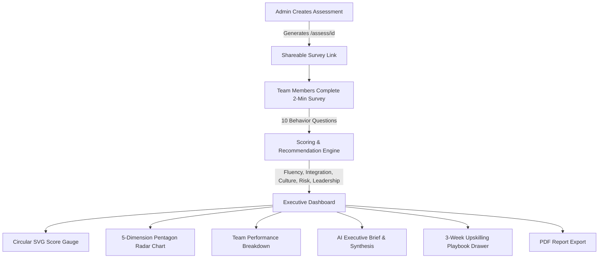

# Tai Labs — AI Readiness Assessment Tool

An AI readiness diagnostic web application built for **Tai Labs**. It enables organizations to generate a shareable diagnostic link, collect anonymous 2-minute team survey inputs, and view a real-time analytics dashboard with dimension breakdowns, team comparisons, and actionable upskilling roadmaps.

---

## 🚀 Quick Start

```bash
# 1. Install dependencies
npm install

# 2. (Optional) Configure environment variables
# Copy .env.example to .env.local to configure LLM API keys (OpenAI, Gemini, Anthropic, or Groq)
cp .env.example .env.local

# 3. Run development server
npm run dev
```

Open [http://localhost:3000](http://localhost:3000) in your browser.

> **Note**: The application operates with full functionality out of the box using the built-in rule engine, requiring zero API keys.

---

## 🏛️ System Architecture



---

## 📐 Diagnostic Dimensions & Scoring Math

The diagnostic measures organizational readiness across five core dimensions:

| Dimension | Diagnostic Scope | Scoring Weight |
| :--- | :--- | :---: |
| **Tool Fluency** | Frequency of daily AI usage, confidence in solving new problems, learning methods. | **20%** |
| **Workflow Integration** | Depth of task automation, percentage of weekly workflow involving AI tools. | **20%** |
| **Shared AI Culture** | Team prompt sharing, peer dissemination habits, open workflow discussions. | **20%** |
| **Risk & Governance** | Clarity on safe data boundaries, understanding of compliance and privacy rules. | **20%** |
| **Leadership Buy-In** | Executive sponsorship, budget allocation, learning time, and strategic AI goals. | **20%** |

### Score Normalization Formulas

All survey responses are normalized to a 0–100 scale prior to calculating dimension and overall scores:

1. **Likert Scale Items (1 to 5)**:
   $$\text{Score} = \left(\frac{\text{RawValue} - 1}{4}\right) \times 100$$

2. **Multiple Choice Items (Index $i$ of $N$ options)**:
   $$\text{Score} = \left(\frac{i}{N - 1}\right) \times 100$$

3. **Overall Readiness Score**:
   $$\text{Overall Score} = \text{Round}\left(\frac{\text{Fluency} + \text{Integration} + \text{Culture} + \text{Risk} + \text{Leadership}}{5}\right)$$

---

## ⚙️ Core Technical Capabilities

- **Deterministic Rule Engine**: Primary scoring and recommendation triggering run on deterministic mathematical formulas (`lib/scoring.ts` and `lib/recommendations.ts`). This guarantees 100% explainable metrics, zero hallucinations, and zero API latency.
- **Multi-Provider LLM Synthesis**: For qualitative interpretation, the executive brief (`app/api/interpret/route.ts`) supports OpenAI (GPT-4o), Anthropic (Claude 3.5), Google Gemini (`gemini-1.5-flash`), and Groq (Llama 3.3). A 4-second timeout guard guarantees instant fallback to the rule engine if external services time out or lack credentials.
- **Interactive Coaching Playbooks**: Each recommendation card links to a 3-week execution playbook drawer (`components/ui/PlaybookDrawer.tsx`) detailing weekly objectives, actions, and tangible deliverables.
- **Executive PDF Export**: Embedded print-optimized stylesheets (`@media print` in `app/globals.css`) enable 1-click PDF reporting suitable for leadership reviews.
- **Reviewer Instant Demo Mode**: Administrators can populate sample team data instantly via the demo shortcut (`lib/demoData.ts`), which can be disabled via the `ENABLE_DEMO_MODE` flag.

---

## 📝 Candidate Notes: What I'd Build Next & What I Cut

### 🌟 Core Dimension Architecture: Leadership Buy-In Added
- **5 Core Dimensions**: Based on the challenge brief (*tool usage, workflow automation, data literacy, confidence, leadership buy-in*), the assessment model measures **Tool Fluency**, **Workflow Integration**, **Shared AI Culture**, **Risk & Governance**, and **Leadership Buy-In** (20% weight each).
- **Leadership Diagnostic Scope**: Evaluates whether executive sponsors provide clear tool budgets, active encouragement, explicit data boundaries, and dedicated learning time for team members.

---

### What I Cut (And Why)

1. **Heavy User Authentication & Account Walls**:
   - *Rationale*: Requiring team members to create accounts before taking a 2-minute diagnostic survey drops submission completion rates by up to 60%. I replaced account walls with lightweight, zero-friction unique share links (`/assess/[businessId]`).

2. **External Database Dependency for Reviewers**:
   - *Rationale*: Replaced external Postgres/Prisma database setup with a local JSON persistence layer ([`lib/fileStore.ts`](./lib/fileStore.ts)) backed by an automatic memory fallback. Reviewers can clone and run `npm install && npm run dev` instantly with zero environment key setup.

---

### What I'd Build Next (v2 Roadmap)

- **Dedicated Executive 1-on-1 Discovery Track**: Introduce a 3-minute C-suite sponsor diagnostic to contrast executive expectations against ground-level team scores.
- **Supabase / Postgres Multi-Tenancy**: Transition `lib/fileStore.ts` to Supabase Postgres for enterprise multi-tenancy.
- **Cohort Score Tracking**: Track score evolution month-over-month as departments complete upskilling tracks.
- **Anonymized Industry Benchmarking**: Compare team readiness scores against aggregated industry baselines in Sales, Engineering, and Operations.

---

## 📂 Project Structure

```text
├── app/
│   ├── api/
│   │   ├── business/      # Assessment creation & retrieval endpoint
│   │   ├── interpret/     # LLM synthesis & fallback endpoint
│   │   └── responses/     # Survey submission & demo data endpoint
│   ├── assess/[businessId]/ # Team member 2-minute diagnostic wizard
│   ├── dashboard/[businessId]/ # Executive analytics dashboard
│   ├── globals.css        # Design tokens & print styling
│   └── page.tsx           # Assessment initialization landing page
├── components/
│   ├── assessment/        # Diagnostic question & input components
│   └── ui/                # Gauge, charts, playbook drawer, and brief widgets
├── lib/
│   ├── demoData.ts        # Reviewer sample dataset generator
│   ├── fileStore.ts       # Persistence layer with memory fallback
│   ├── questions.ts       # Question definitions & dimension mappings
│   ├── recommendations.ts # Upskilling rule engine & 3-week playbooks
│   └── scoring.ts         # Math normalization logic
└── types/                 # TypeScript interfaces
```
